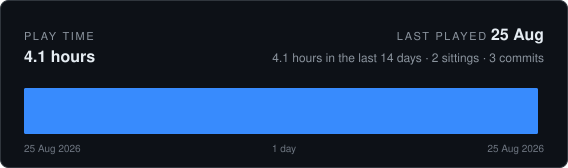
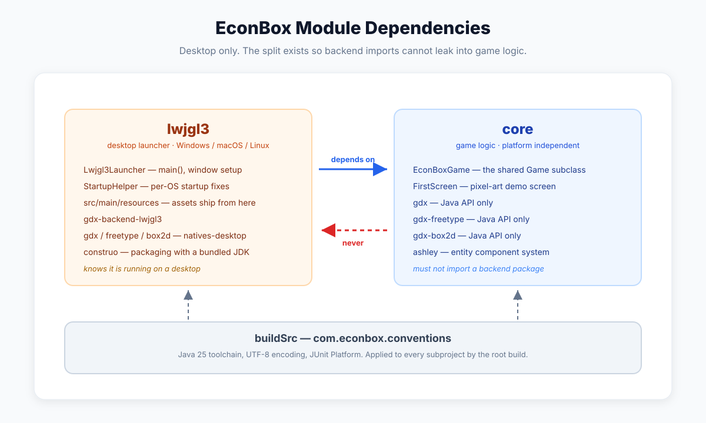

# EconBox

<!-- CODING-TIME:START -->



<details>
<summary>How this is counted</summary>

Commits record when work was saved, never how long it took, so this is an
estimate rather than a timesheet. Commits less than 120 minutes apart
count as one sitting and contribute the real time between them; a commit that
opens a sitting contributes a flat 120 minutes for the work that led up to
it. Merges are skipped, and nothing that was never committed is visible here.

Covers every author. Regenerated on each commit by `.githooks/coding-time`,
which reads commit timestamps and nothing else. `GAP_MINUTES`, `OPENING_MINUTES`,
`RECENT_DAYS` and `DAYS` change what it assumes.

</details>

<!-- CODING-TIME:END -->



A desktop game on [libGDX](https://libgdx.com/), generated with the official
[gdx-liftoff](https://github.com/libgdx/gdx-liftoff) 1.14.2.1 scaffold and built with the same
Gradle setup as the V31 monorepo: Kotlin DSL, `buildSrc` convention plugin, versions in
`gradle.properties`, Apache 2.0 headers.

| | |
|---|---|
| libGDX | 1.14.2 |
| Java | 25 (`buildJavaVersion` / `runtimeJavaVersion`) |
| Gradle | 9.7.1 (wrapper) |
| Target | Desktop - Windows / macOS / Linux, via LWJGL3 |
| Extensions | FreeType (fonts), Box2D (physics), Ashley (ECS) |

## Commands

```bash
./gradlew lwjgl3:run     # run the game
./gradlew lwjgl3:jar     # fat JAR at lwjgl3/build/libs/EconBox-0.1.0.jar, runs with java -jar
./gradlew build          # compile everything and run the tests
```

Packaged builds with a bundled JDK, so players need no Java installed. Output lands in
`lwjgl3/build/construo/dist/`:

```bash
./gradlew lwjgl3:packageMacM1 --no-configuration-cache
```

Targets are `macM1`, `macX64`, `winX64`, `linuxX64`. The `--no-configuration-cache` flag is
required because construo's packaging tasks are not configuration-cache compatible yet.

## Git hooks

Hooks live in `.githooks/`, migrated verbatim from the V31 monorepo. A fresh clone does not pick
them up on its own -- `core.hooksPath` is local configuration, not something a repository can
carry -- so turn them on once:

```bash
git config core.hooksPath .githooks
```

`pre-commit` then runs `coding-time` on every commit: it reads commit timestamps, redraws the
play-time card at the top of this file, and stages the card and the README alongside your own
changes. It stages only the files it actually rewrote, and it never blocks a commit -- a broken
counter is not a reason to lose work.

Run it by hand to refresh the card without committing:

```bash
.githooks/coding-time
```

What it assumes can be overridden from the environment: `GAP_MINUTES` (how long a pause ends a
sitting), `OPENING_MINUTES` (credit for the commit that opens one), `RECENT_DAYS`, and `DAYS`
(how much history the chart covers).

## Layout

```
EconBox/
├── buildSrc/                    The build's own source, compiled first
│   └── src/main/kotlin/
│       └── com.econbox.conventions.gradle.kts
├── core/                        Game logic - no backend-specific code
│   └── src/main/java/com/econbox/
│       ├── EconBoxGame.java     Game subclass; owns the shared batch and skin
│       └── FirstScreen.java     Pixel-art sky demo; replace with real gameplay
├── lwjgl3/                      Desktop launcher, assets and packaging
│   ├── icons/                   Icons used by construo
│   └── src/main/
│       ├── java/com/econbox/lwjgl3/
│       │   ├── Lwjgl3Launcher.java  main(); window configuration
│       │   └── StartupHelper.java   Per-OS startup workarounds
│       └── resources/           Runtime assets, packed into the JAR
│           ├── ui/              scene2d skin and bitmap fonts
│           └── libgdx*.png      Window icons
├── gradle.properties            Versions, group, Java release, Gradle flags
├── settings.gradle.kts          Modules and repositories
└── build.gradle.kts             Applies the conventions plugin to every subproject
```

## How the build works

Same shape as V31. The root build applies `com.econbox.conventions` to every subproject, and
each subproject declares whatever else it needs. Versions live in `gradle.properties` rather
than a version catalog; `buildSrc/settings.gradle.kts` loads that file by hand, since a separate
build does not inherit it.

Java 25 comes from a toolchain, not `sourceCompatibility`, so the JDK running the Gradle daemon
has no effect on the bytecode. Repositories are locked to Maven Central through
`FAIL_ON_PROJECT_REPOS` - do not declare repositories in a subproject.

The libGDX artifacts and their `natives-desktop` counterparts all read `gdxVersion`. Keep it
that way: a mismatch between them compiles cleanly and then fails at runtime inside JNI. Java
APIs go in `core`; the `natives-desktop` artifacts belong in `lwjgl3`, because which natives are
needed is a property of the platform, not of the game logic.

Assets live in `lwjgl3/src/main/resources/`, not in a shared top-level `assets/` directory. The
scaffold puts them at the repository root so that several platform modules can register the same
folder as a resource root; with desktop as the only target there is nothing to share them with,
so they sit in the module that ships them. Paths are unchanged either way -- the resources
directory maps to the root of the JAR, so `Gdx.files.internal("ui/uiskin.json")` still resolves.
`:lwjgl3:run` sets its working directory to that resources folder, so editing a texture or a
skin takes effect on the next launch without a rebuild.

## Changes made to the generated scaffold

Everything below is a deviation from raw liftoff output, and each is here for a reason.

| Change | Why |
|---|---|
| Groovy build scripts rewritten as Kotlin DSL with `buildSrc` | Match the V31 build |
| `gradle/gradle-daemon-jvm.properties` repinned from 21 to 25 | liftoff writes 21 whatever Java version you pick, so `:core:compileJava` failed with `invalid source release: 25` |
| construo `jdkUrl` moved from Temurin 21 to 25 | A JDK 21 runtime cannot load Java 25 bytecode; packaged builds would die with `UnsupportedClassVersionError` |
| `ENABLE_NATIVE_ACCESS` added to `StartupHelper` | It re-execs the JVM with `-cp`, dropping the JAR manifest's `Enable-Native-Access`, so macOS warned on every launch |
| `distTar` / `distZip` disabled | They shipped the fat JAR plus a second copy of every dependency, ~79 MB per build |
| Dropped `nativeimage.gradle`, `generateAssetList`, per-OS `jarMac`/`jarLinux`/`jarWin` | GraalVM was off by default, the asset manifest only matters for the web backend, and the fat JAR covers all three desktop platforms |
| `assets/` moved into `lwjgl3/src/main/resources/` | The root-level folder exists to be shared by several platform modules; this project targets desktop only, so it is a cross-directory resource root with nothing on the other end |

## The demo screen

`FirstScreen` is a 2D pixel-art sky: a banded gradient, drifting clouds, a two-tone sun, and a
flock of birds. The orange bird flies with the arrow keys or WASD. It replaces the empty screen
the scaffold generates, which would just open a black window.

Three things make it read as pixel art rather than as scaled-up vector shapes:

- The world is 320x180 and the window is 1280x720, an exact 4x, so one world unit is always a
  clean 4x4 block of screen pixels.
- Sprites are char grids (`BIRD_UP`, `CLOUD`, ...) drawn one quad per set cell, and every draw is
  floored to a whole world unit. Edit the strings to change the art.
- Nothing is rotated. A rotated quad produces a smooth diagonal edge, which is exactly what
  breaks the look; the birds flap by swapping frames instead.

There are no image files behind any of it. Everything is the skin atlas's single white pixel,
tinted with `SpriteBatch.setColor`.

Delete the whole class when real gameplay starts.

## Console warnings on macOS

**`WARNING: A restricted method in java.lang.System has been called`** (four lines, naming
`org.lwjgl.system.Library`). Java 24+ requires native access to be granted explicitly. It is
granted in three places: the `jvmArgs` applied to every `JavaExec` task, the fat JAR's
`Enable-Native-Access` manifest attribute, and the child JVM that `StartupHelper` spawns. Launch
through Gradle -- `./gradlew lwjgl3:run`, or the committed **Run EconBox** configuration -- and
the warning does not appear.

It comes back under a launcher that bypasses all three, notably the gutter arrow on `main()`
while the IDE is set to *Build and run using: IntelliJ IDEA*, which starts a plain `java` process
with no VM options. Either use the Gradle run configuration, or add the flags once to the IDE's
Application run-configuration template:

```
--enable-native-access=ALL-UNNAMED -XstartOnFirstThread
```

The flag has to be on the command line of the JVM that starts; nothing inside `main()` can grant
it afterwards. On macOS `StartupHelper` loads an LWJGL native to inspect the current thread
*before* deciding whether to re-exec, so even the re-exec path warns once in the parent process.

**`TSM AdjustCapsLockLEDForKeyTransitionHandling`** and **`error messaging the mach port for
IMKCFRunLoopWakeUpReliable`**. This is macOS logging, not the game's: the `java[pid:tid]` prefix
is NSLog's format, TSM is the Text Services Manager and IMK the Input Method Kit. The lines
appear when the window takes keyboard focus, and nothing in this project calls either framework.
There is no supported way to suppress them from inside a Java process, and they are harmless.

**The Gradle launcher itself warns too.** Before any project code runs, the Gradle launcher
prints the same restricted-method warning from its own native-platform library. That one belongs
to Gradle:

```bash
export GRADLE_OPTS="--enable-native-access=ALL-UNNAMED"
```

## Notes

**Non-Latin text.** The bundled `assets/ui/` skin font is Latin-only. Rendering CJK means putting
a `.ttf` with the right glyphs into `lwjgl3/src/main/resources/` and building the font at
runtime with
`FreeTypeFontGenerator` - which is why FreeType is included.

**Desktop is the only target, by decision.** That is also what makes Java 25 possible: Android's
D8, TeaVM (web) and RoboVM (iOS) accept Java 17 or 21 bytecode at most, so a mobile or web build
would have to lower `runtimeJavaVersion` for `core` and move the assets back to a shared
top-level folder. The `core` / `lwjgl3` split is kept anyway, to stop backend imports leaking
into game logic and to keep unit tests off the LWJGL3 classpath.

**`StartupHelper` has one local modification.** It re-execs the JVM with `-cp`, which drops a
packaged JAR's `Enable-Native-Access` manifest attribute, so the flag is re-added explicitly. The
change is marked in the source; keep it if you ever refresh the file from upstream libGDX.
